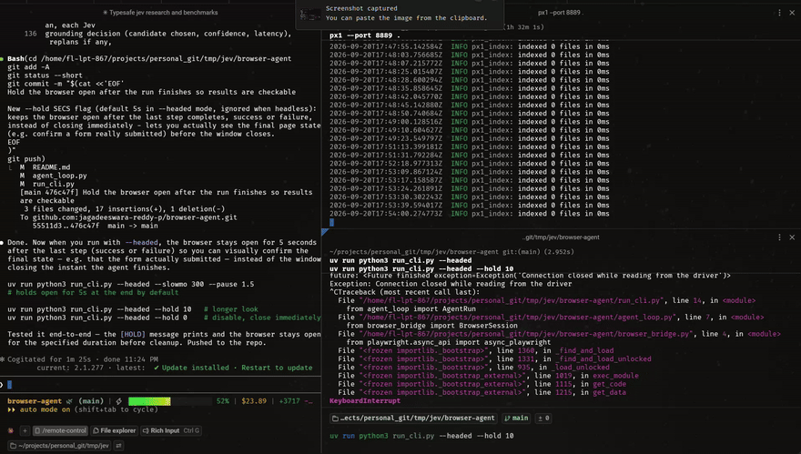

# Jev Browser Agent



[Watch the full-quality video instead](https://github.com/jagadeeswara-reddy-p/browser-agent/releases/download/demo-media/screencast.webm)

> Notes:
> - The GIF above is a downscaled (880px wide, 12fps) copy of the same
>   screencast, committed directly to the repo at `demo/screencast.gif` and
>   referenced by a plain relative path - unlike `<video>`, GitHub renders
>   markdown images from a repo-relative path just fine, so this one actually
>   autoplays inline with no click needed.
> - The linked `.webm` is the original full-resolution, full-quality
>   recording, hosted as a [GitHub Release asset](https://github.com/jagadeeswara-reddy-p/browser-agent/releases/tag/demo-media)
>   (a relative path wouldn't render `<video>` inline - GitHub only does that
>   for their own attachment CDN or a Release asset URL).
> - This repo is private, so both will only load for accounts with access,
>   viewed while logged in on github.com.

A proof of concept for an AI-driven browser automation agent: give it a
sequence of steps in plain English, and it understands, plans, and executes
them in a real browser — navigating, clicking, typing, extracting data, and
running small computations on the results.

It splits the work across three purpose-fit pieces instead of asking one
model to do everything:

- **A planner LLM** (`dev-model-alpha`, via a gateway) reads your instruction
  and decomposes it into an ordered list of atomic steps. It's the only piece
  that authors free text (e.g. deciding literal values to type), and it's
  called again to replan if a step fails.
- **[Jev](https://typesafe.ai)** (TypeSafe's "System One" model) does one
  narrow, repeated job: given a text list of every visible clickable/typeable
  element on the current page, decide *which one* matches a step's target
  description (`"the Submit button"`, `"the Password field"`) — or honestly
  say none of them do. It never sees a screenshot (it's text-only) and never
  decides what to do next; it just grounds a description to a specific
  element, fast and cheap.
- **Playwright** does the actual browser work: reading the page's interactive
  elements, and executing the click/fill/extract that Jev and the planner
  decided on.

## Why split it this way

Jev is a "System One" model: it returns typed, calibrated decisions (a
`choice` from an option set, a `score`, or a yes/no `noul`) instead of
generating text, and it's built to be fast/cheap for exactly this kind of
narrow, repeated, structured decision. Grounding "which element matches this
description" is a bounded choice problem — a good fit. Deciding what the
overall task means, breaking it into steps, and writing the literal content
to type needs actual language generation, which is the planner LLM's job.
Playwright's own accessibility snapshot API is fast enough (single-digit
milliseconds) that it's never the bottleneck; the Jev API call dominates
per-step latency (a few hundred ms).

## How a run works

1. **Plan** — the planner LLM turns your instruction into a JSON step list:
   `navigate`, `type`, `click`, `extract`, `code`, or `done`.
2. **Observe** — before each `click`/`type`/`extract` step, Playwright scans
   the live page for visible interactive elements and builds a plain-text
   candidate list (human-readable label + tag/type for each one).
3. **Ground** — that candidate list, plus the step's target description, goes
   to Jev as a single `choice` question, with an explicit "none of these"
   option. Jev returns which candidate matches (or none), with a confidence
   score.
4. **Act** — if Jev found a confident match, Playwright clicks/fills/reads
   that element. `type` steps use the literal text the planner already wrote
   into the step; Jev never generates the text.
5. **Replan on failure** — if Jev says "none of these" (or confidence is
   below threshold), the current page's full candidate list and the failure
   reason go back to the planner LLM, which returns a corrected step list to
   continue from.
6. **Code steps** — for pure computation on previously-extracted values (e.g.
   "double the number you just read"), the planner emits literal Python,
   executed in a restricted scope with no filesystem/network access.

## Project layout

| File | Role |
|---|---|
| `planner_client.py` | Planner LLM client (decompose + replan) |
| `browser_bridge.py` | Playwright session: candidate extraction, click/fill/extract |
| `jev_grounding.py` | The single Jev `choice` call per grounding decision, with confidence gating |
| `agent_loop.py` | Orchestrator tying planner → grounding → browser together, with the replan loop |
| `run_cli.py` | Text-mode runner (also supports a visible, slowed-down browser for watching it work) |
| `jev_client.py` | Thin async client for Jev's `/v1/systemone` endpoint |
| `env_loader.py` | Loads credentials from a `.env` file — no manual `source` needed |

## Setup

Requires [`uv`](https://docs.astral.sh/uv/) and Python 3.11+.

```bash
uv sync
```

This creates `.venv/` and installs Playwright + httpx. Playwright needs
Chromium available — if `uv run python3 -c "from playwright.sync_api import sync_playwright as s; s().start().chromium.launch().close()"`
fails with a missing-browser error, install it once with:

```bash
uv run playwright install chromium
```

### Credentials

Create a `.env` file in this directory (never committed — see `.gitignore`)
with:

```
TYPESAFE_API_KEY=your_typesafe_api_key
GATEWAY_API_KEY=your_planner_gateway_api_key
GATEWAY_BASE_URL=https://your-openai-compatible-gateway/v1
```

- `TYPESAFE_API_KEY` — from [typesafe.ai](https://typesafe.ai), used for Jev grounding calls.
- `GATEWAY_API_KEY` / `GATEWAY_BASE_URL` — any OpenAI-compatible chat-completions
  endpoint for the planner model. `planner_client.py` defaults to
  `dev-model-alpha` as the model name and authenticates with an `x-api-key`
  header (not `Authorization: Bearer`) — adjust `planner_client.py` if your
  gateway uses a different scheme or model name.

## Running it

```bash
# Headless, built-in demo (fills and submits a public test form)
uv run python3 run_cli.py

# Your own instruction
uv run python3 run_cli.py "Go to https://example.com/login, type \"me@example.com\" into the email field, type \"password123\" into the password field, then click Sign In."

# Watch it work in a real, visible browser window
uv run python3 run_cli.py --headed --slowmo 300 --pause 1.5

# Watch your own instruction, slowed down
uv run python3 run_cli.py --headed --slowmo 300 --pause 1.5 "your instruction here"
```

Flags:
- `--headed` — opens a visible Chromium window instead of running headless
- `--slowmo MS` — adds artificial delay (ms) to each low-level Playwright
  action, so clicks/typing are visible instead of instant
- `--pause SECS` — pauses after each agent step completes, so you have time
  to read the console log alongside the browser
- `--hold SECS` — keeps the browser open for this long after the run finishes
  (success or failure) before closing, so you can actually check the final
  page state (e.g. that a form really submitted) instead of the window
  vanishing the instant the last step completes. Defaults to 5s in `--headed`
  mode; ignored (treated as 0) when headless, since there's nothing to look at.

The CLI prints every event as it happens: the decomposed plan, each Jev
grounding decision (candidate chosen, confidence, latency), replans if any,
and the final extracted variables.

## What's validated

- Full multi-field form fill + submit, with the submitted values verified
  correct on the resulting page
- Jev correctly returning "not found" (not a wrong guess) for elements that
  don't exist on the page, with high confidence
- Automatic replanning when a step's target isn't found — the planner is
  handed the failure and the current page's real elements, and returns a
  corrected continuation
- `extract` steps (reading a field's value into a named variable) and `code`
  steps (computing on previously-extracted variables) end-to-end

## Real-world scenarios solved

Beyond the built-in demo form, these are real, messy, multi-step instructions
against real live sites that were run end-to-end (not mocked) while building
this agent - each one found and fixed a genuine bug, listed here as worked
examples of what the agent can actually do and proof it isn't cherry-picked.

### 1. Google search

```bash
uv run python3 run_cli.py "go google.com and search for cute puppies"
```

**What this proved:** typing into the search box and clicking the Search
button both ground correctly on a real, complex, unfamiliar page (27+
candidates). **What it fixed:** Google's search button sat behind an
autocomplete suggestions dropdown after typing, so a plain click hung the
full 30s Playwright timeout ("subtree intercepts pointer events"). `click()`
now fails fast (5s) and falls back to a forced click, then a JS-dispatched
click - verified the query actually reached Google's URL after the fix.
(Google itself then serves a bot-detection page for headless/automated
traffic - expected, and not something this project tries to get around.)

### 2. yopmail.com — enter an address and check the inbox

```bash
uv run python3 run_cli.py "go yopmail.coom and enter the email bill@yopmail.com"
```

(Typo and all - the planner handles it fine.) **What this proved:** a single
ambiguous field (yopmail's inbox-lookup input has no `aria-label`, just a
generic `placeholder="Enter your inbox here"`) still grounds correctly even
when the instruction's wording ("the inbox email field") doesn't closely
match the placeholder text. **What it fixed:** grounding used to reject this
exact, correct match because of an internal confidence threshold - Jev
picked the only real candidate at just 0.16-0.23 confidence, which got
treated as "not found" and burned the whole replan budget rewording a
description for a target that was there the whole time. Removed the
threshold: a real (non-`__none__`) choice from Jev is now trusted as its
answer regardless of confidence, matching how Third Hand (the reference
project) actually does it.

### 3. yopmail.com — send an email, then find it as the recipient

```bash
uv run python3 run_cli.py --headed --hold 3 "go yopmail.coom and enter the email bill@yopmail.com and once that is done send an email to bill1@yopmail.com and go back to the home page and login as bill1@yopmail.com and find the just now sent email"
```

A single instruction spanning two full inbox sessions and a compose flow -
13 resolved steps by the time it finishes. **What this proved (verified by
actually opening the received email afterward):** subject "Test", sender
`bill@yopmail.com`, body "Test" - the message that arrived was exactly the
one sent, not just "some click happened." **What it fixed, all found live
while debugging this one instruction:**

- yopmail's compose ("newmail") and Send buttons are icon-only - their real
  text was a meaningless Material Icons glyph character that won over more
  useful signals. Label priority is now `aria-label` → `<label>` →
  `placeholder` → `title` → cleaned inner text (glyphs stripped, not an
  all-or-nothing reject) → `alt`/`value`/`name` → the element's own `id` as
  a last resort (this is how the compose button - no title, no aria-label,
  nothing but `id="newmail"` - becomes findable at all).
- The compose form (recipient/subject fields) loads inside an **iframe**;
  `snapshot()` only scanned the top-level document and saw nothing there.
  Now scans every frame on the page.
- The Send button starts `disabled` and stays that way until Subject *and*
  Body are filled in. Disabled buttons used to be filtered out of candidates
  entirely, so Jev could only ever report "not found" - never "found, but
  disabled" - giving the replanner nothing useful to act on. Now included
  (annotated `(disabled)`), and the agent checks enabled-state before
  clicking, feeding back a specific, actionable reason instead of a dead
  end - which is exactly how the planner figured out on its own, across two
  separate replans, that it needed to fill Subject *and* Body before Send
  would work.
- The message body is a rich-text `contenteditable` div, not a `<textarea>`
  - wasn't in the candidate selector at all.
- Grounding is **stochastic, not deterministic**: the exact same
  single-candidate question against the exact same page was verified to
  return found≈35%/not-found≈65% purely from sampling variance, not page
  state drift. A full replan can't fix that (the one real candidate never
  changes, only the wording does), so a cheap same-question retry (up to 3x)
  now runs before escalating to an expensive replan call.
- A long replan (this instruction needed one that added 7+ new steps at
  once) got cut off mid-JSON on the default token budget, crashing with
  `AttributeError`/`ValueError`. Raised the planner's `max_tokens`, added
  salvage logic that recovers every complete step object up to a truncation
  cutoff instead of failing the whole plan, and broadened `agent_loop`'s
  exception handling so a planner/Jev failure is a clean, reported result,
  never a raw crash.
- `max_replans` raised from 2 to 6 - this scenario alone needed 5 replans
  across icon-button resolution and the two required-field discoveries, and
  each replan is one cheap API call, not worth failing prematurely over.

## Known limitations

- No visual UI yet — CLI only, though `--headed` mode lets you watch the
  actual browser.
- Grounding is text-only, no OCR/vision fallback: an icon-only control with
  no `aria-label`, `title`, `placeholder`, meaningful text, or usable `id`
  genuinely can't be identified. (Icon-font glyph text, iframes, disabled
  buttons, and contenteditable rich-text fields are all handled - see
  `browser_bridge.py`'s label-priority logic and frame-scanning `snapshot()`.)
- Grounding is stochastic, not deterministic: a genuinely close call (weak
  wording match, single ambiguous candidate) can flip between found/not-found
  across identical calls. There's a cheap same-question retry for the
  single-candidate case, but this is inherent to using a probabilistic model
  for the decision, not something a code fix eliminates entirely.
- The planner's replan budget is capped (`max_replans`, default 6) to avoid
  infinite loops on a truly broken page/instruction.
- `code` steps run in a restricted `exec()` scope (no imports, no I/O) — this
  is a POC-level safeguard, not a hardened sandbox.
